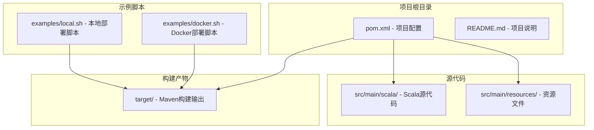
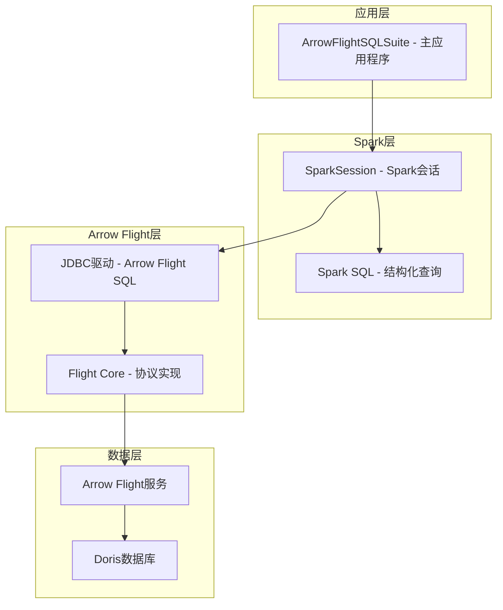
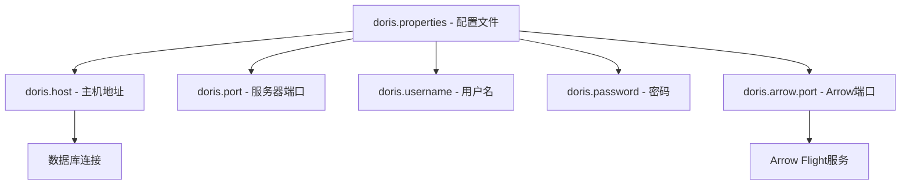
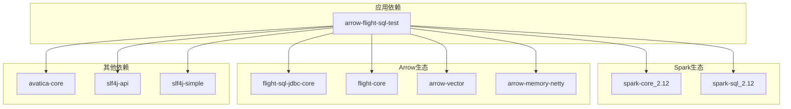

# 依赖与环境要求

<cite>
**本文档引用的文件**
- [pom.xml](file://pom.xml)
- [README.md](file://README.md)
- [examples/docker.sh](file://examples/docker.sh)
- [examples/local.sh](file://examples/local.sh)
- [src/main/resources/doris.properties](file://src/main/resources/doris.properties)
- [src/main/scala/com/portofino/arrow/ArrowFlightSQLSuite.scala](file://src/main/scala/com/portofino/arrow/ArrowFlightSQLSuite.scala)
</cite>

## 目录
1. [简介](#简介)
2. [项目结构](#项目结构)
3. [核心组件](#核心组件)
4. [架构概览](#架构概览)
5. [详细组件分析](#详细组件分析)
6. [依赖分析](#依赖分析)
7. [性能考虑](#性能考虑)
8. [故障排除指南](#故障排除指南)
9. [结论](#结论)
10. [附录](#附录)

## 简介
本项目是一个Arrow Flight SQL测试项目，用于验证通过Arrow Flight SQL JDBC驱动连接Doris数据库并读取数据的功能。该项目基于Apache Spark和Apache Arrow技术栈，提供了完整的依赖配置和环境要求说明。

## 项目结构
项目采用标准的Maven多模块结构，主要包含以下目录：
- `src/main/scala/` - Scala源代码目录
- `src/main/resources/` - 资源文件目录
- `examples/` - 示例脚本和配置文件
- `target/` - Maven构建输出目录



**图表来源**
- [pom.xml](file://pom.xml#L1-L146)
- [examples/docker.sh](file://examples/docker.sh#L1-L58)
- [examples/local.sh](file://examples/local.sh#L1-L60)

**章节来源**
- [pom.xml](file://pom.xml#L1-L146)
- [README.md](file://README.md#L1-L3)

## 核心组件
项目的核心组件包括：

### 1. Apache Spark组件
- **Spark Core**: 提供分布式计算框架基础
- **Spark SQL**: 提供结构化数据处理能力
- **版本要求**: 3.5.8

### 2. Apache Arrow组件
- **Arrow Flight SQL JDBC Core**: Arrow Flight SQL的JDBC驱动核心
- **Arrow Flight Core**: Arrow Flight协议核心实现
- **Arrow Vector**: 向量化的内存管理
- **Arrow Memory Netty**: 基于Netty的内存管理
- **版本要求**: 17.0.0

### 3. 其他依赖
- **Apache Calcite Avatica**: JDBC驱动支持
- **SLF4J API/Simple**: 日志记录框架

**章节来源**
- [pom.xml](file://pom.xml#L19-L84)
- [src/main/scala/com/portofino/arrow/ArrowFlightSQLSuite.scala](file://src/main/scala/com/portofino/arrow/ArrowFlightSQLSuite.scala#L1-L164)

## 架构概览
项目采用分层架构设计，主要包含以下层次：



**图表来源**
- [src/main/scala/com/portofino/arrow/ArrowFlightSQLSuite.scala](file://src/main/scala/com/portofino/arrow/ArrowFlightSQLSuite.scala#L17-L61)
- [pom.xml](file://pom.xml#L36-L48)

## 详细组件分析

### Maven构建配置分析
项目使用Maven进行依赖管理和构建，配置了多个插件来支持Scala开发和打包。

#### 编译器配置
- **Java版本**: 11
- **Scala版本**: 2.12.18
- **二进制版本**: 2.12

#### 构建插件
1. **Maven Compiler Plugin**: 版本3.11.0
2. **Scala Maven Plugin**: 版本4.8.0
3. **Maven Shade Plugin**: 版本3.1.0

#### 依赖管理策略
- 使用`provided`作用域的依赖会被排除在最终包之外
- 通过Shade插件进行依赖合并，避免运行时冲突

**章节来源**
- [pom.xml](file://pom.xml#L9-L17)
- [pom.xml](file://pom.xml#L86-L144)

### 运行时配置分析
项目提供了两种运行模式：Docker容器化部署和本地部署。

#### Docker部署配置
- **基础镜像**: apache/spark:3.5.8
- **网络配置**: 使用自定义网络doris_custom_network
- **挂载卷**: 将编译后的JAR文件挂载到/opt/spark/jars/
- **Java选项**: 添加--add-opens=java.base/java.nio=ALL-UNNAMED

#### 本地部署配置
- **环境变量**: 需要设置SPARK_HOME
- **Spark提交**: 使用spark-submit命令
- **配置参数**: 支持通过命令行传递Arrow Flight SQL配置

**章节来源**
- [examples/docker.sh](file://examples/docker.sh#L37-L52)
- [examples/local.sh](file://examples/local.sh#L44-L54)

### 数据源配置分析
项目使用Doris作为数据源，配置文件包含以下关键参数：



**图表来源**
- [src/main/resources/doris.properties](file://src/main/resources/doris.properties#L1-L9)

**章节来源**
- [src/main/resources/doris.properties](file://src/main/resources/doris.properties#L1-L9)

## 依赖分析

### 核心依赖关系图


**图表来源**
- [pom.xml](file://pom.xml#L19-L84)

### 版本兼容性矩阵
基于当前配置，以下是推荐的版本兼容性矩阵：

| 组件 | 当前版本 | 推荐范围 | 最低要求 |
|------|----------|----------|----------|
| Java | 11 | 11+ | 8 |
| Scala | 2.12.18 | 2.12.x | 2.12.0 |
| Spark | 3.5.8 | 3.5.x | 3.0.0 |
| Arrow Flight SQL | 17.0.0 | 17.x.x | 17.0.0 |
| Avatica | 1.25.0 | 1.25.x | 1.20.0 |
| SLF4J | 1.7.36 | 1.7.x | 1.7.0 |

**章节来源**
- [pom.xml](file://pom.xml#L9-L16)

### 可选依赖和高级功能
项目中存在一些可选的高级功能配置：

#### Spark JDBC读取功能
在代码中可以看到注释掉的Spark JDBC读取功能，可以通过取消注释来启用：

```scala
// val df = spark.read
//   .format("jdbc")
//   .option("url", url)
//   .option("driver", "org.apache.arrow.driver.jdbc.ArrowFlightJdbcDriver")
//   .option("user", user)
//   .option("password", password)
//   .option("dbtable", s"($query) as subquery")
//   .load()
```

#### Arrow Flight SQL端口配置
支持通过配置项`doris.read.arrow-flight-sql.port`来指定Arrow Flight SQL端口。

**章节来源**
- [src/main/scala/com/portofino/arrow/ArrowFlightSQLSuite.scala](file://src/main/scala/com/portofino/arrow/ArrowFlightSQLSuite.scala#L125-L162)

## 性能考虑
基于项目配置和使用场景，以下是性能相关的考虑因素：

### JVM内存配置
- **推荐设置**: 根据数据量大小调整Spark driver和executor内存
- **Java选项**: 已包含--add-opens参数以支持Java 16+的模块系统

### 网络优化
- **Arrow Flight连接**: 使用TCP连接，建议在同一网络环境下部署
- **Doris集群**: 建议使用负载均衡和高可用配置

### 数据传输优化
- **Arrow格式**: 利用Arrow的零拷贝特性提高数据传输效率
- **批处理**: 合理设置批处理大小以平衡内存使用和吞吐量

## 故障排除指南

### 常见问题及解决方案

#### 1. 依赖冲突问题
**症状**: 运行时出现ClassNotFoundException或NoClassDefFoundError
**解决方案**:
- 检查所有Arrow相关依赖版本是否一致
- 确保Shade插件正确合并了所有必要的依赖
- 清理并重新构建项目：`mvn clean package`

#### 2. Spark版本不兼容
**症状**: Spark启动失败或功能异常
**解决方案**:
- 确认Spark版本与Arrow Flight SQL版本兼容
- 检查Scala版本匹配情况
- 验证Spark配置文件完整性

#### 3. Arrow Flight连接问题
**症状**: 无法连接到Arrow Flight服务
**解决方案**:
- 验证Doris Arrow Flight服务端口可达性
- 检查防火墙和网络配置
- 确认用户名和密码正确性

#### 4. Docker部署问题
**症状**: Docker容器启动失败或网络连接错误
**解决方案**:
- 确认Doris自定义网络已创建
- 检查JAR文件路径和权限
- 验证容器间网络连通性

**章节来源**
- [examples/docker.sh](file://examples/docker.sh#L31-L35)
- [examples/local.sh](file://examples/local.sh#L37-L42)

## 结论
本项目提供了一个完整的Arrow Flight SQL测试框架，基于Apache Spark和Apache Arrow技术栈。通过明确的依赖管理和构建配置，确保了跨平台的兼容性和可移植性。项目支持Docker和本地两种部署方式，为不同环境下的测试需求提供了灵活的选择。

## 附录

### 开发工具和IDE推荐配置
- **IDE**: IntelliJ IDEA或Eclipse Scala IDE
- **插件**: Scala插件、Maven插件
- **JDK**: Java 11或更高版本
- **Scala IDE**: Scala 2.12.18

### 环境变量设置
```bash
export JAVA_HOME=/usr/lib/jvm/java-11-openjdk
export SCALA_HOME=/usr/share/scala
export SPARK_HOME=/opt/spark-3.5.8
export PATH=$PATH:$JAVA_HOME/bin:$SCALA_HOME/bin:$SPARK_HOME/bin
```

### 操作系统兼容性
- **Linux**: 完全支持，推荐Ubuntu 18.04+
- **macOS**: 支持，需要Xcode命令行工具
- **Windows**: 通过WSL或Docker支持

### 硬件要求
- **CPU**: 至少4核处理器
- **内存**: 至少8GB RAM
- **存储**: 至少20GB可用空间
- **网络**: 100Mbps以上稳定网络连接

### 构建和运行步骤
1. **克隆项目**: `git clone <repository-url>`
2. **构建项目**: `mvn clean package`
3. **配置Doris**: 更新doris.properties文件
4. **运行测试**: 
   - 本地运行: `./examples/local.sh`
   - Docker运行: `./examples/docker.sh`