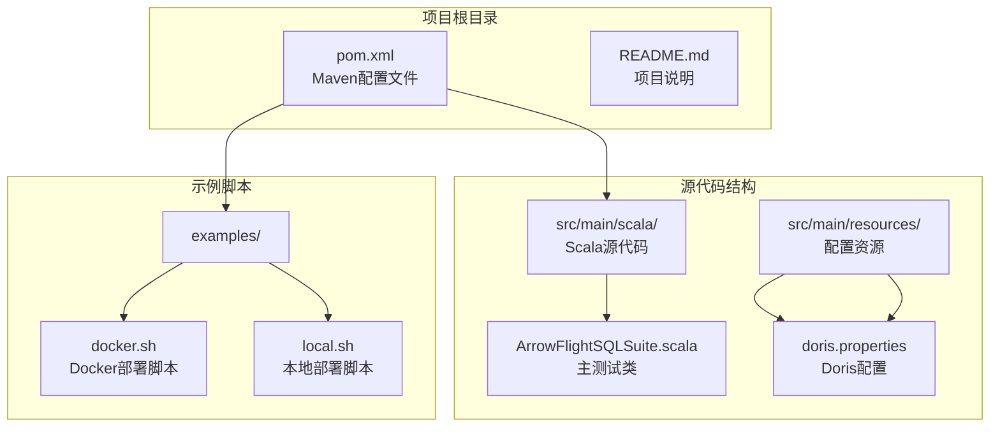
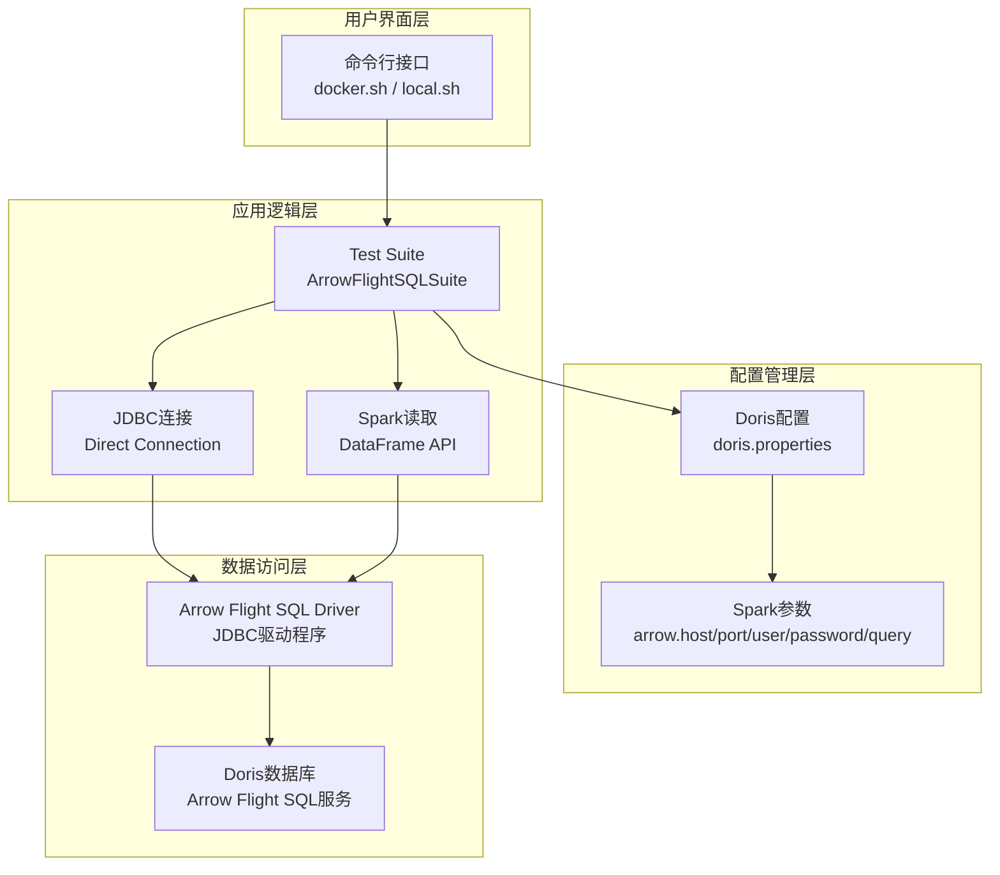
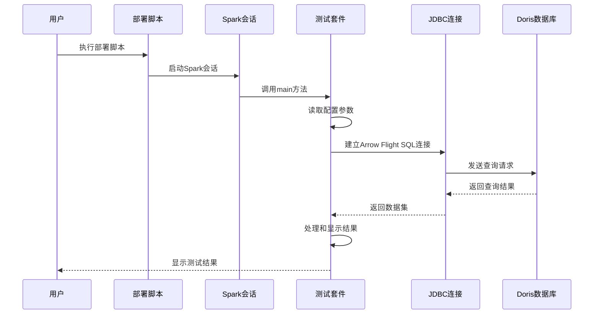
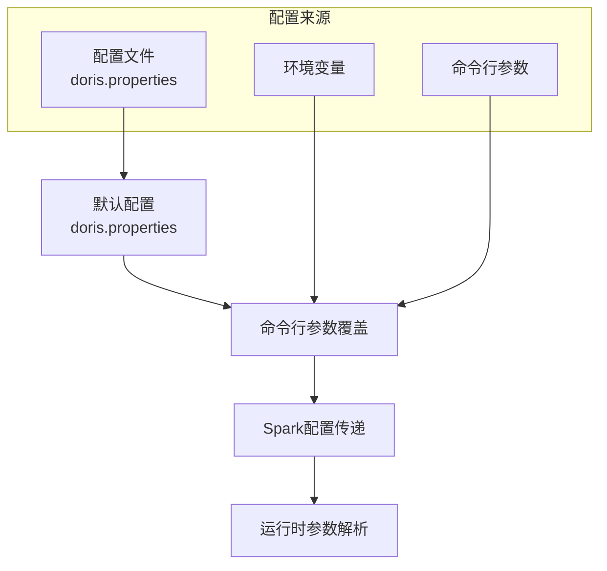
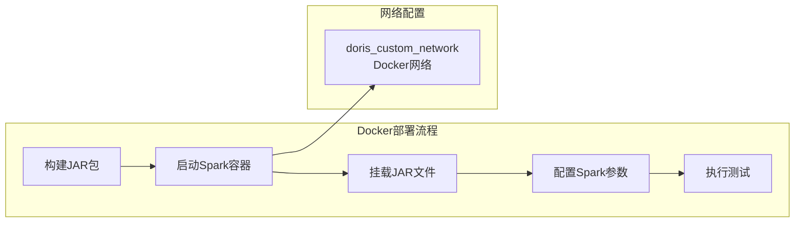
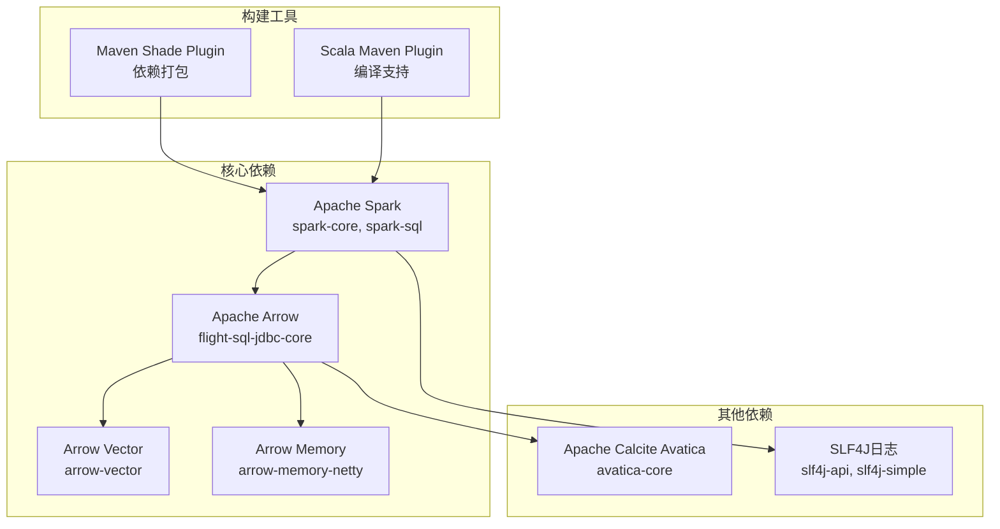

# 快速开始

<cite>
**本文档引用的文件**
- [README.md](file://README.md)
- [pom.xml](file://pom.xml)
- [docker.sh](file://examples/docker.sh)
- [local.sh](file://examples/local.sh)
- [doris.properties](file://src/main/resources/doris.properties)
- [ArrowFlightSQLSuite.scala](file://src/main/scala/com/portofino/arrow/ArrowFlightSQLSuite.scala)
</cite>

## 目录
1. [简介](#简介)
2. [项目结构](#项目结构)
3. [核心组件](#核心组件)
4. [架构概览](#架构概览)
5. [详细组件分析](#详细组件分析)
6. [依赖分析](#依赖分析)
7. [性能考虑](#性能考虑)
8. [故障排除指南](#故障排除指南)
9. [结论](#结论)
10. [附录](#附录)

## 简介

Arrow Flight SQL 测试项目是一个用于验证通过 Arrow Flight SQL 协议连接和查询 Doris 数据库功能的测试框架。该项目展示了如何使用 Apache Arrow Flight SQL JDBC 驱动程序与 Doris 数据库进行交互，提供了 Docker 和本地两种部署方式，帮助开发者快速验证 Arrow Flight SQL 功能。

该项目的核心目标是：
- 验证 Arrow Flight SQL 协议在 Doris 数据库中的可用性
- 提供简单的测试用例来演示数据读取功能
- 支持多种部署环境以适应不同的开发需求

**章节来源**
- [README.md](file://README.md#L1-L3)

## 项目结构

项目采用标准的 Maven 结构，主要包含以下目录和文件：



**图表来源**
- [pom.xml](file://pom.xml#L1-L146)
- [ArrowFlightSQLSuite.scala](file://src/main/scala/com/portofino/arrow/ArrowFlightSQLSuite.scala#L1-L164)
- [doris.properties](file://src/main/resources/doris.properties#L1-L9)

**章节来源**
- [pom.xml](file://pom.xml#L1-L146)
- [ArrowFlightSQLSuite.scala](file://src/main/scala/com/portofino/arrow/ArrowFlightSQLSuite.scala#L1-L164)

## 核心组件

### 主要测试类

项目的核心是 `ArrowFlightSQLSuite` 对象，它包含了完整的测试逻辑：

- **直接 JDBC 连接测试**：验证 Arrow Flight SQL 驱动程序的连接能力
- **Spark JDBC 读取测试**：演示如何使用 Spark DataFrame API 读取数据
- **配置参数管理**：支持通过 Spark 配置传递连接参数

### 配置系统

项目使用 `doris.properties` 文件管理数据库连接配置：

- **Doris 基础配置**：主机名、端口、用户名、密码
- **Arrow Flight SQL 配置**：Arrow Flight SQL 端口号
- **灵活的配置加载**：支持通过命令行参数覆盖默认值

### 部署脚本

项目提供两个部署脚本以适应不同环境：

- **Docker 版本**：自动构建并运行包含所有依赖的容器
- **本地版本**：要求本地已安装 Spark 环境

**章节来源**
- [ArrowFlightSQLSuite.scala](file://src/main/scala/com/portofino/arrow/ArrowFlightSQLSuite.scala#L17-L61)
- [doris.properties](file://src/main/resources/doris.properties#L1-L9)
- [docker.sh](file://examples/docker.sh#L1-L58)
- [local.sh](file://examples/local.sh#L1-L60)

## 架构概览

项目采用分层架构设计，清晰分离了配置、业务逻辑和部署层面：



**图表来源**
- [ArrowFlightSQLSuite.scala](file://src/main/scala/com/portofino/arrow/ArrowFlightSQLSuite.scala#L19-L61)
- [doris.properties](file://src/main/resources/doris.properties#L1-L9)
- [docker.sh](file://examples/docker.sh#L38-L52)

## 详细组件分析

### ArrowFlightSQLSuite 主测试类

该类是整个测试项目的核心，实现了完整的测试流程：



**图表来源**
- [ArrowFlightSQLSuite.scala](file://src/main/scala/com/portofino/arrow/ArrowFlightSQLSuite.scala#L19-L61)
- [ArrowFlightSQLSuite.scala](file://src/main/scala/com/portofino/arrow/ArrowFlightSQLSuite.scala#L66-L120)

#### 关键功能特性

1. **参数化配置**：支持通过 Spark 配置传递连接参数
2. **多层测试**：同时验证直接 JDBC 连接和 Spark 集成
3. **错误处理**：完善的异常捕获和错误报告机制
4. **资源管理**：确保数据库连接和 Spark 会话正确关闭

**章节来源**
- [ArrowFlightSQLSuite.scala](file://src/main/scala/com/portofino/arrow/ArrowFlightSQLSuite.scala#L17-L164)

### 配置管理系统

配置系统采用层次化设计，支持灵活的参数覆盖：



**图表来源**
- [doris.properties](file://src/main/resources/doris.properties#L1-L9)
- [ArrowFlightSQLSuite.scala](file://src/main/scala/com/portofino/arrow/ArrowFlightSQLSuite.scala#L32-L37)

#### 配置参数详解

| 参数名称 | 默认值 | 描述 | 用途 |
|---------|--------|------|------|
| `arrow.host` | `doris-fe` | Doris FE 主机地址 | 数据库连接主机 |
| `arrow.port` | `8070` | Arrow Flight SQL 端口 | 数据库通信端口 |
| `arrow.user` | `root` | 用户名 | 认证凭据 |
| `arrow.password` | 空字符串 | 密码 | 认证凭据 |
| `arrow.query` | 测试查询语句 | SQL 查询语句 | 测试数据读取 |

**章节来源**
- [doris.properties](file://src/main/resources/doris.properties#L1-L9)
- [ArrowFlightSQLSuite.scala](file://src/main/scala/com/portofino/arrow/ArrowFlightSQLSuite.scala#L32-L37)

### 部署脚本分析

项目提供两种部署方式，每种都有其特定的适用场景：

#### Docker 部署脚本

Docker 版本的优势：
- **环境隔离**：完全隔离的运行环境
- **依赖管理**：自动包含所有必要的依赖
- **可移植性**：跨平台兼容性强
- **一致性**：确保所有环境的一致性



**图表来源**
- [docker.sh](file://examples/docker.sh#L38-L52)

#### 本地部署脚本

本地版本的优势：
- **开发便利**：便于调试和开发
- **性能优势**：避免容器开销
- **资源控制**：更好的系统资源控制
- **灵活性**：可以使用本地工具链

**章节来源**
- [docker.sh](file://examples/docker.sh#L1-L58)
- [local.sh](file://examples/local.sh#L1-L60)

## 依赖分析

项目使用 Maven 管理依赖关系，核心依赖包括：



**图表来源**
- [pom.xml](file://pom.xml#L19-L84)

### 依赖版本管理

项目采用统一的版本管理策略：

| 组件 | 版本 | 用途 |
|------|------|------|
| Java | 11 | 运行时环境 |
| Scala | 2.12.18 | 编程语言 |
| Spark | 3.5.8 | 分布式计算框架 |
| Arrow Flight SQL | 17.0.0 | 数据传输协议 |
| Calcite Avatica | 1.25.0 | JDBC 协议支持 |

**章节来源**
- [pom.xml](file://pom.xml#L9-L17)
- [pom.xml](file://pom.xml#L19-L84)

## 性能考虑

### 连接优化

1. **连接池管理**：合理管理数据库连接生命周期
2. **查询优化**：使用 LIMIT 子句限制返回数据量
3. **内存管理**：注意大数据集的内存使用情况

### 并发处理

- **Spark 并行度**：根据数据量调整并行度设置
- **线程安全**：确保 JDBC 连接的线程安全性
- **资源清理**：及时释放数据库连接和 Spark 资源

## 故障排除指南

### 常见问题及解决方案

#### 1. JAR 文件缺失

**问题症状**：部署脚本报错提示找不到 JAR 文件

**解决步骤**：
1. 运行 Maven 构建命令生成 JAR 文件
2. 检查 `target/` 目录是否存在构建产物
3. 确认 Maven 构建过程没有错误

**相关命令**：
```bash
mvn clean package
```

#### 2. Docker 网络连接问题

**问题症状**：Docker 版本无法连接到 Doris 服务

**解决步骤**：
1. 确认 Docker 网络 `doris_custom_network` 已创建
2. 验证 Doris 服务在指定网络中可访问
3. 检查防火墙和端口配置

#### 3. Spark 环境配置问题

**问题症状**：本地版本报错提示未设置 `SPARK_HOME`

**解决步骤**：
1. 设置 `SPARK_HOME` 环境变量
2. 确保 Spark 安装目录正确
3. 验证 Spark 可执行文件权限

#### 4. 数据库连接失败

**问题症状**：测试过程中出现连接超时或认证失败

**解决步骤**：
1. 检查 `doris.properties` 中的连接参数
2. 验证 Doris 服务状态和端口开放情况
3. 确认用户凭据的正确性

**章节来源**
- [docker.sh](file://examples/docker.sh#L29-L35)
- [local.sh](file://examples/local.sh#L37-L42)
- [ArrowFlightSQLSuite.scala](file://src/main/scala/com/portofino/arrow/ArrowFlightSQLSuite.scala#L53-L58)

## 结论

Arrow Flight SQL 测试项目为验证 Arrow Flight SQL 协议在 Doris 数据库中的功能提供了一个完整且易于使用的框架。通过 Docker 和本地两种部署方式，用户可以根据自己的需求选择最适合的部署方案。

该项目的主要优势包括：
- **简单易用**：提供一键部署的脚本和清晰的配置文件
- **环境友好**：支持多种部署环境，适应不同开发需求
- **功能完整**：涵盖直接 JDBC 连接和 Spark 集成测试
- **易于扩展**：模块化的架构设计便于功能扩展

建议用户根据实际开发环境选择合适的部署方式，并根据具体需求调整配置参数。

## 附录

### 快速开始步骤

#### 步骤 1：环境准备

1. **安装必要工具**：
   - Git
   - Maven
   - Docker（可选）
   - Spark（可选）

2. **克隆项目**：
   ```bash
   git clone <repository-url>
   cd arrow-flight-sql-test
   ```

#### 步骤 2：配置数据库连接

编辑 `src/main/resources/doris.properties` 文件，设置正确的数据库连接参数。

#### 步骤 3：选择部署方式

**Docker 方式**：
```bash
./examples/docker.sh
```

**本地方式**：
```bash
export SPARK_HOME=/path/to/spark
./examples/local.sh
```

#### 步骤 4：自定义查询

可以通过命令行参数传递自定义 SQL 查询：
```bash
./examples/local.sh "SELECT * FROM your_table LIMIT 1000"
```

### 验证安装成功

完成部署后，检查以下输出确认安装成功：

1. **连接建立**：看到 "Connection established" 的成功消息
2. **查询执行**：显示查询结果和列信息
3. **数据展示**：成功显示数据表的结构和内容
4. **测试完成**：最后显示 "Test completed" 的完成消息

### 配置文件说明

#### doris.properties 配置项

| 配置项 | 默认值 | 说明 |
|--------|--------|------|
| `doris.host` | `doris-fe` | Doris FE 主机名 |
| `doris.port` | `9030` | Doris 服务端口 |
| `doris.username` | `root` | 数据库用户名 |
| `doris.password` | 空字符串 | 数据库密码 |
| `doris.arrow.port` | `8070` | Arrow Flight SQL 端口 |

### 常用命令参考

#### Maven 构建命令
```bash
# 清理并构建项目
mvn clean package

# 仅编译源代码
mvn compile

# 运行单元测试
mvn test
```

#### Docker 部署命令
```bash
# 构建并运行测试
./examples/docker.sh

# 使用自定义查询
./examples/docker.sh "SELECT COUNT(*) FROM test_table"
```

#### 本地部署命令
```bash
# 设置 Spark 环境
export SPARK_HOME=/path/to/spark

# 运行测试
./examples/local.sh

# 使用自定义查询
./examples/local.sh "SELECT * FROM your_table LIMIT 500"
```