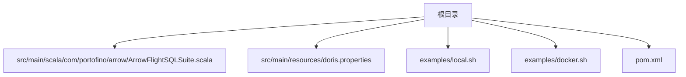
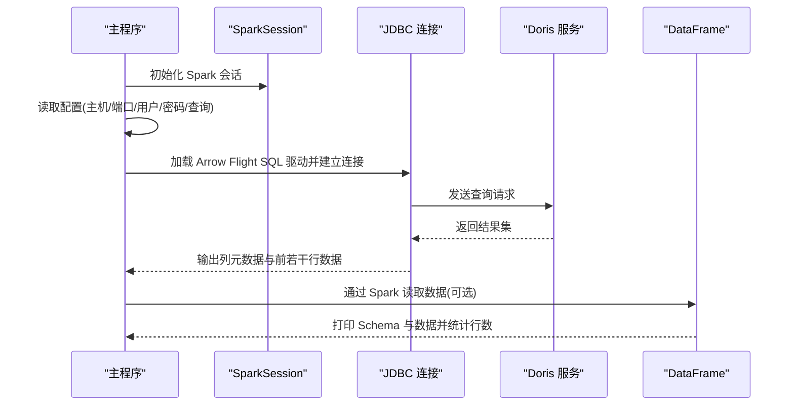
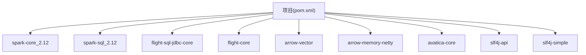

# 核心测试套件

<cite>
**本文引用的文件**
- [README.md](file://README.md)
- [ArrowFlightSQLSuite.scala](file://src/main/scala/com/portofino/arrow/ArrowFlightSQLSuite.scala)
- [pom.xml](file://pom.xml)
- [doris.properties](file://src/main/resources/doris.properties)
- [local.sh](file://examples/local.sh)
- [docker.sh](file://examples/docker.sh)
</cite>

## 目录
1. [简介](#简介)
2. [项目结构](#项目结构)
3. [核心组件](#核心组件)
4. [架构总览](#架构总览)
5. [详细组件分析](#详细组件分析)
6. [依赖关系分析](#依赖关系分析)
7. [性能考虑](#性能考虑)
8. [故障排除指南](#故障排除指南)
9. [结论](#结论)
10. [附录](#附录)

## 简介
本项目是一个用于验证通过 Arrow Flight SQL 与 Doris 数据库进行交互的测试套件，重点覆盖：
- 直连 JDBC 的连接与查询流程
- 基于 Spark 的 JDBC 读取与 DataFrame 展示
- 本地与 Docker 两种运行方式的脚本与配置
- 测试数据准备、验证策略与故障排除方法
- 开发者扩展与定制测试用例的建议

该套件的核心入口为单机对象，负责加载 Spark 会话、读取配置、执行 JDBC 查询，并展示通过 Spark 读取的数据集。

**章节来源**
- [README.md](file://README.md#L1-L3)

## 项目结构
项目采用标准 Maven 结构，核心源码位于 Scala 包路径下，测试运行脚本位于 examples 目录，资源文件存放于 resources 目录。

**图表来源**
- [ArrowFlightSQLSuite.scala](file://src/main/scala/com/portofino/arrow/ArrowFlightSQLSuite.scala#L1-L164)
- [doris.properties](file://src/main/resources/doris.properties#L1-L9)
- [local.sh](file://examples/local.sh#L1-L60)
- [docker.sh](file://examples/docker.sh#L1-L58)
- [pom.xml](file://pom.xml#L1-L146)

**章节来源**
- [ArrowFlightSQLSuite.scala](file://src/main/scala/com/portofino/arrow/ArrowFlightSQLSuite.scala#L1-L164)
- [pom.xml](file://pom.xml#L1-L146)

## 核心组件
- 单机对象：负责初始化 Spark 会话、读取配置、执行 JDBC 连接测试与 Spark JDBC 读取测试。
- JDBC 连接测试：加载 Arrow Flight SQL JDBC 驱动，构建连接 URL，设置用户凭据，执行查询并打印元数据与部分数据。
- Spark JDBC 读取测试：通过 Spark 的 JDBC 读取器或 Doris 专用格式读取数据，打印 Schema 与数据内容，并统计总行数。

关键实现要点：
- 使用 SparkSession.builder().master("local[4]") 在本地启动多核模式。
- 从 Spark 配置中读取主机、端口、用户名、密码与查询语句。
- JDBC 连接采用 org.apache.arrow.driver.jdbc.ArrowFlightJdbcDriver。
- Spark 读取支持两种路径：JDBC 方式与 Doris 专用格式。

**章节来源**
- [ArrowFlightSQLSuite.scala](file://src/main/scala/com/portofino/arrow/ArrowFlightSQLSuite.scala#L19-L61)
- [ArrowFlightSQLSuite.scala](file://src/main/scala/com/portofino/arrow/ArrowFlightSQLSuite.scala#L66-L120)
- [ArrowFlightSQLSuite.scala](file://src/main/scala/com/portofino/arrow/ArrowFlightSQLSuite.scala#L125-L162)

## 架构总览
整体测试流程由两部分组成：直连 JDBC 与 Spark JDBC/Doris 读取。下图展示了从配置到输出的关键步骤。

**图表来源**
- [ArrowFlightSQLSuite.scala](file://src/main/scala/com/portofino/arrow/ArrowFlightSQLSuite.scala#L19-L61)
- [ArrowFlightSQLSuite.scala](file://src/main/scala/com/portofino/arrow/ArrowFlightSQLSuite.scala#L66-L120)
- [ArrowFlightSQLSuite.scala](file://src/main/scala/com/portofino/arrow/ArrowFlightSQLSuite.scala#L125-L162)

## 详细组件分析

### 组件一：主程序与配置加载
- 初始化 Spark 会话，设置应用名为 ArrowFlightSQLTest，本地多核模式。
- 从 Spark 配置中读取以下键值：
  - arrow.host：Doris FE 主机名，默认 doris-fe
  - arrow.port：Doris Arrow Flight SQL 端口，默认 8070
  - arrow.user：数据库用户名，默认 root
  - arrow.password：数据库密码，默认空
  - arrow.query：要执行的 SQL 查询，默认 SELECT * FROM test_db.user_visit LIMIT 100
- 打印配置信息后依次执行 JDBC 连接测试与 Spark JDBC 读取测试。
- 异常处理：捕获异常并打印错误信息，退出码为 1；最终停止 Spark 会话。

最佳实践：
- 在生产环境中，建议通过 spark-submit 的 --conf 参数显式传入配置，避免硬编码。
- 对于查询语句，建议使用 LIMIT 控制初始数据量，便于快速验证。

**章节来源**
- [ArrowFlightSQLSuite.scala](file://src/main/scala/com/portofino/arrow/ArrowFlightSQLSuite.scala#L24-L61)

### 组件二：JDBC 连接测试
- 加载 Arrow Flight SQL JDBC 驱动类。
- 构造连接 URL，包含 useServerPrepStmts、cachePrepStmts、useSSL、useEncryption 等参数。
- 设置用户与密码属性，建立连接。
- 创建 Statement 执行查询，获取元数据并打印列名与类型。
- 限制最多打印 20 行数据，便于快速验证。
- 关闭 Statement 与 Connection。

验证策略：
- 成功建立连接后，打印“Connection established”。
- 打印列元数据与部分数据，确保字段类型与数据正确性。
- 若出现异常，捕获并打印堆栈信息，便于定位问题。

**章节来源**
- [ArrowFlightSQLSuite.scala](file://src/main/scala/com/portofino/arrow/ArrowFlightSQLSuite.scala#L66-L120)

### 组件三：Spark JDBC 读取测试
- 当前实现使用 Doris 专用格式读取数据，示例注释展示了 JDBC 路径的写法。
- 通过 SparkSession.read.format("doris") 加载数据，设置表标识符、FE 节点、用户与密码等选项。
- 打印 Schema 与数据内容，并统计总行数。
- 异常处理：捕获异常并打印错误信息。

验证策略：
- 成功创建 DataFrame 后，打印 Schema 与数据，确认字段与数据正确。
- 使用 count() 获取总行数，验证查询结果规模。

**章节来源**
- [ArrowFlightSQLSuite.scala](file://src/main/scala/com/portofino/arrow/ArrowFlightSQLSuite.scala#L125-L162)

### 组件四：测试脚本与运行方式
- 本地脚本 local.sh：
  - 从 doris.properties 读取 Doris 主机、Arrow 端口、用户名与密码。
  - 检查目标 JAR 是否存在，SPARK_HOME 是否设置。
  - 使用 spark-submit 提交应用，传递配置项与类名。
- Docker 脚本 docker.sh：
  - 同样从 doris.properties 读取配置。
  - 将打包好的 JAR 映射到容器内，使用官方 Spark 镜像运行 spark-submit。
  - 传递相同的配置项与类名。

运行建议：
- 本地运行时，确保 SPARK_HOME 已设置且版本兼容。
- Docker 运行时，确保网络可达（如 doris_custom_network）且映射的 JAR 路径正确。

**章节来源**
- [local.sh](file://examples/local.sh#L1-L60)
- [docker.sh](file://examples/docker.sh#L1-L58)

## 依赖关系分析
Maven 依赖包括 Spark 核心与 SQL、Arrow Flight SQL JDBC 核心与 Flight 核心、Arrow Vector、Arrow Memory Netty、Apache Calcite Avatica、SLF4J API 与 Simple。构建插件包括 Scala 编译插件与 Shade 插件，Shade 插件用于聚合 Arrow 与相关依赖，避免运行时缺失。

**图表来源**
- [pom.xml](file://pom.xml#L19-L84)

**章节来源**
- [pom.xml](file://pom.xml#L1-L146)

## 性能考虑
- 本地运行模式使用 local[4]，可根据 CPU 核心数调整并发度。
- JDBC 查询默认限制打印 20 行数据，避免大量数据输出影响性能与可读性。
- Spark 读取时建议在查询中使用 LIMIT 或分页策略，减少初始数据量。
- Arrow Flight SQL 传输优化：确保网络稳定，避免频繁小包传输。

[本节为通用性能建议，不直接分析具体文件]

## 故障排除指南
常见问题与排查步骤：
- 驱动未找到：确认已加载 Arrow Flight SQL JDBC 驱动类。
- 连接失败：检查主机、端口、用户名与密码是否正确；确认 Doris FE 与 Arrow Flight SQL 服务可用。
- 查询异常：检查 SQL 语法与权限；尝试简化查询（如添加 LIMIT）。
- Spark 读取失败：确认 Spark 版本与 Arrow/Avatica 依赖兼容；检查网络与认证配置。
- 本地脚本错误：确认 SPARK_HOME 已设置；检查 JAR 文件是否存在；核对配置项。
- Docker 运行错误：确认容器网络可达；检查 JAR 映射路径；核对类名与配置项。

**章节来源**
- [ArrowFlightSQLSuite.scala](file://src/main/scala/com/portofino/arrow/ArrowFlightSQLSuite.scala#L53-L60)
- [ArrowFlightSQLSuite.scala](file://src/main/scala/com/portofino/arrow/ArrowFlightSQLSuite.scala#L157-L162)
- [local.sh](file://examples/local.sh#L37-L42)
- [docker.sh](file://examples/docker.sh#L38-L41)

## 结论
本测试套件提供了从直连 JDBC 到 Spark 读取的完整验证链路，覆盖了 Arrow Flight SQL 与 Doris 的集成场景。通过本地与 Docker 两种运行方式，开发者可以快速搭建测试环境并验证数据读取的正确性。建议在实际项目中结合业务查询进行扩展，增加更多维度的验证（如复杂查询、事务控制、错误重试等）。

[本节为总结性内容，不直接分析具体文件]

## 附录

### A. 测试数据准备与管理
- 准备 Doris 表：确保存在 test_db.user_visit 或自定义表，并具备相应权限。
- 配置文件：在 doris.properties 中设置 doris.host、doris.port、doris.username、doris.password、doris.arrow.port。
- 查询语句：通过 arrow.query 指定初始查询，建议使用 LIMIT 控制数据量。

**章节来源**
- [doris.properties](file://src/main/resources/doris.properties#L1-L9)
- [ArrowFlightSQLSuite.scala](file://src/main/scala/com/portofino/arrow/ArrowFlightSQLSuite.scala#L32-L37)

### B. 测试环境要求与配置选项
- Java：11+
- Scala：2.12.18
- Spark：3.5.8
- Arrow：17.0.0
- 运行方式：本地或 Docker
- 关键配置项：
  - arrow.host：Doris FE 主机
  - arrow.port：Arrow Flight SQL 端口
  - arrow.user：数据库用户名
  - arrow.password：数据库密码
  - arrow.query：SQL 查询语句

**章节来源**
- [pom.xml](file://pom.xml#L9-L17)
- [ArrowFlightSQLSuite.scala](file://src/main/scala/com/portofino/arrow/ArrowFlightSQLSuite.scala#L32-L37)

### C. 代码级使用示例与最佳实践
- 直连 JDBC 示例：加载驱动、构造 URL、设置凭据、执行查询、打印元数据与数据。
- Spark 读取示例：使用 SparkSession.read.format("doris") 读取数据，打印 Schema 与数据，统计行数。
- 最佳实践：
  - 使用 spark-submit 传递配置项，避免硬编码。
  - 在查询中使用 LIMIT，便于快速验证。
  - 对异常进行捕获与日志记录，便于定位问题。
  - 在 Docker 环境中确保网络与映射路径正确。

**章节来源**
- [ArrowFlightSQLSuite.scala](file://src/main/scala/com/portofino/arrow/ArrowFlightSQLSuite.scala#L66-L120)
- [ArrowFlightSQLSuite.scala](file://src/main/scala/com/portofino/arrow/ArrowFlightSQLSuite.scala#L125-L162)

### D. 扩展与定制测试用例指导
- 新增查询验证：在 arrow.query 中添加不同类型的 SQL（聚合、连接、子查询等），观察输出与性能。
- 多环境测试：在本地与 Docker 环境分别运行，对比行为一致性。
- 错误注入：模拟网络中断、权限不足等场景，验证异常处理与恢复能力。
- 性能基准：在相同硬件条件下，比较不同查询与数据量下的吞吐与延迟。
- 自定义驱动：根据需要替换或扩展 JDBC 驱动配置，验证兼容性。

[本节为扩展性建议，不直接分析具体文件]