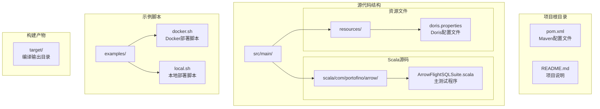
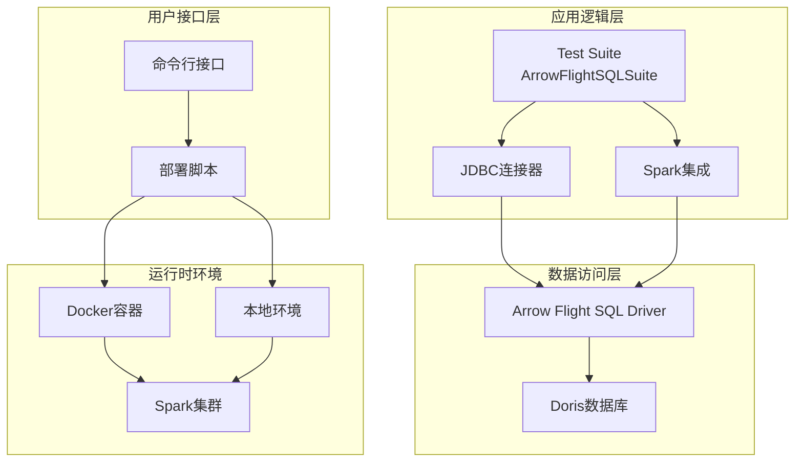
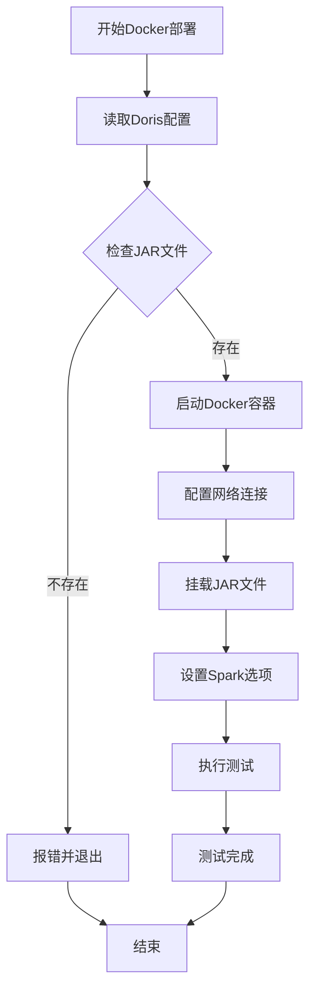
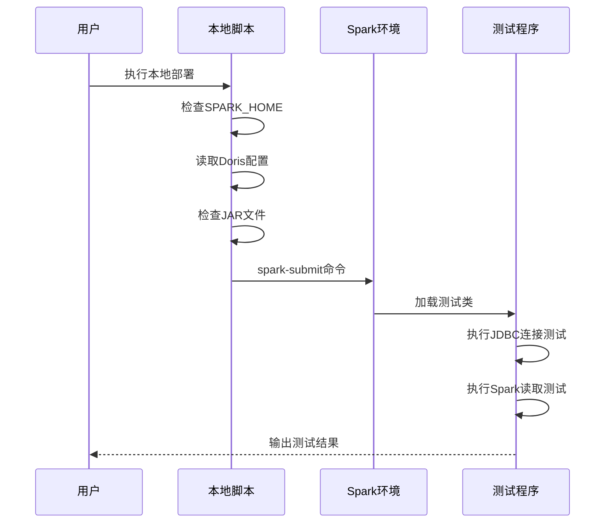
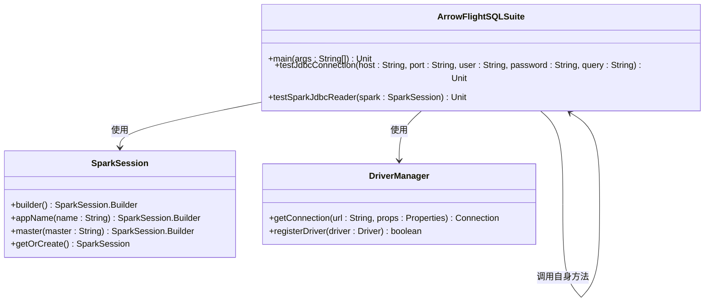
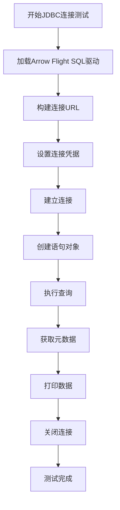
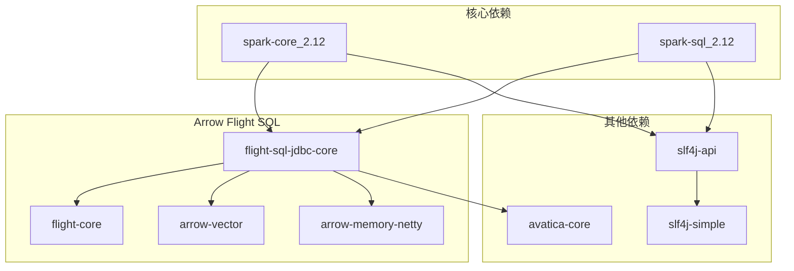
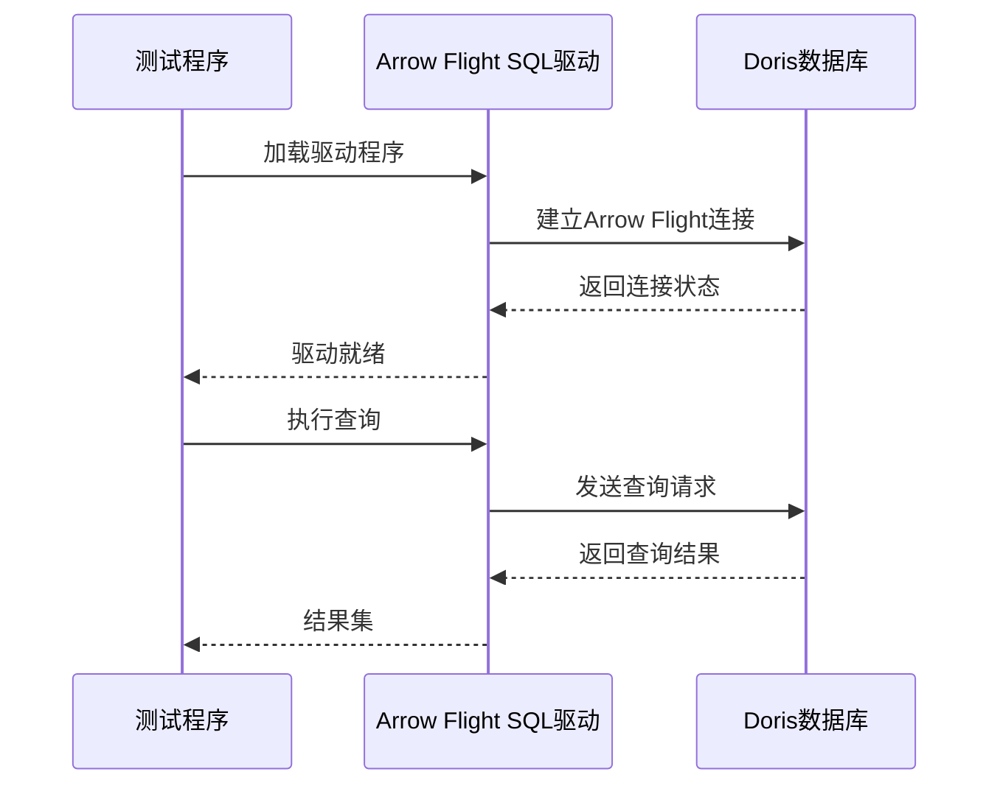
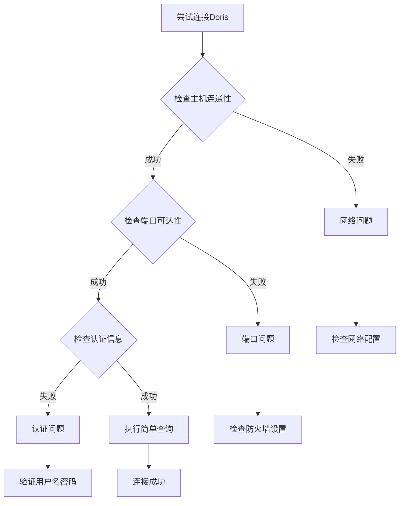

# 部署与配置

<cite>
**本文引用的文件**
- [README.md](file://README.md)
- [pom.xml](file://pom.xml)
- [doris.properties](file://src/main/resources/doris.properties)
- [docker.sh](file://examples/docker.sh)
- [local.sh](file://examples/local.sh)
- [ArrowFlightSQLSuite.scala](file://src/main/scala/com/portofino/arrow/ArrowFlightSQLSuite.scala)
</cite>

## 目录
1. [简介](#简介)
2. [项目结构](#项目结构)
3. [核心组件](#核心组件)
4. [架构概览](#架构概览)
5. [详细组件分析](#详细组件分析)
6. [依赖关系分析](#依赖关系分析)
7. [性能考虑](#性能考虑)
8. [故障排除指南](#故障排除指南)
9. [结论](#结论)
10. [附录](#附录)

## 简介

Arrow Flight SQL测试项目是一个用于验证通过Arrow Flight SQL协议连接Doris数据库功能的测试工具。该项目提供了两种部署方式：Docker容器化部署和本地部署，支持通过Spark和直接JDBC两种方式访问Doris数据库。

该项目的核心目标是：
- 验证Arrow Flight SQL JDBC驱动程序与Doris数据库的兼容性
- 提供Docker和本地两种部署模式
- 支持Spark SQL和直接JDBC连接方式
- 展示Arrow Flight SQL协议在大数据生态系统中的应用

## 项目结构

项目采用标准的Maven多模块结构，主要包含以下目录和文件：



**图表来源**
- [pom.xml](file://pom.xml#L1-L146)
- [ArrowFlightSQLSuite.scala](file://src/main/scala/com/portofino/arrow/ArrowFlightSQLSuite.scala#L1-L164)

**章节来源**
- [README.md](file://README.md#L1-L3)
- [pom.xml](file://pom.xml#L1-L146)

## 核心组件

### 主要依赖组件

项目使用了多个Apache Arrow和Spark相关的依赖组件：

| 组件名称 | 版本 | 用途 |
|---------|------|------|
| Apache Spark | 3.5.8 | 大数据处理框架 |
| Apache Arrow Flight SQL JDBC Core | 17.0.0 | Arrow Flight SQL JDBC驱动 |
| Apache Arrow Flight Core | 17.0.0 | Arrow Flight协议核心 |
| Apache Arrow Vector | 17.0.0 | 向量计算支持 |
| Apache Arrow Memory Netty | 17.0.0 | 内存管理 |
| Apache Calcite Avatica | 1.25.0 | JDBC协议支持 |

### 配置文件结构

项目包含以下关键配置文件：

1. **doris.properties** - Doris数据库连接配置
2. **pom.xml** - Maven构建配置和依赖管理
3. **部署脚本** - Docker和本地部署自动化

**章节来源**
- [pom.xml](file://pom.xml#L19-L84)
- [doris.properties](file://src/main/resources/doris.properties#L1-L9)

## 架构概览

项目采用分层架构设计，支持多种部署模式：



**图表来源**
- [ArrowFlightSQLSuite.scala](file://src/main/scala/com/portofino/arrow/ArrowFlightSQLSuite.scala#L17-L61)
- [docker.sh](file://examples/docker.sh#L37-L52)
- [local.sh](file://examples/local.sh#L44-L54)

## 详细组件分析

### Docker部署脚本分析

Docker部署脚本提供了完整的容器化部署流程：

#### 脚本功能概述



**图表来源**
- [docker.sh](file://examples/docker.sh#L1-L58)

#### 关键配置参数

| 参数 | 默认值 | 描述 |
|------|--------|------|
| doris.host | doris-fe | Doris前端主机名 |
| doris.arrow.port | 8070 | Arrow Flight SQL端口 |
| doris.username | root | 数据库用户名 |
| doris.password | 空字符串 | 数据库密码 |

#### Docker运行参数详解

脚本使用了以下关键Docker运行参数：

1. **网络配置**: `--network doris_custom_network`
   - 使用自定义Docker网络确保容器间通信

2. **卷挂载**: `-v "$JAR_FILE:/opt/spark/jars/arrow-flight-sql-test.jar"`
   - 将编译好的JAR文件挂载到Spark容器中

3. **Spark提交参数**:
   - `--master local[*]`: 使用本地模式运行
   - `--driver-java-options`: Java运行时选项
   - `--conf arrow.host`: 设置Doris主机地址

**章节来源**
- [docker.sh](file://examples/docker.sh#L1-L58)
- [doris.properties](file://src/main/resources/doris.properties#L1-L9)

### 本地部署脚本分析

本地部署脚本提供了直接在宿主机上运行的方式：

#### 部署流程



**图表来源**
- [local.sh](file://examples/local.sh#L1-L60)

#### 环境要求

1. **SPARK_HOME环境变量**: 必须设置为Spark安装目录
2. **Java版本**: 支持Java 11及以上版本
3. **Maven构建**: 需要先执行`mvn clean package`生成JAR文件

**章节来源**
- [local.sh](file://examples/local.sh#L1-L60)

### 主测试程序分析

主测试程序实现了完整的Arrow Flight SQL连接测试：

#### 类结构图



**图表来源**
- [ArrowFlightSQLSuite.scala](file://src/main/scala/com/portofino/arrow/ArrowFlightSQLSuite.scala#L17-L61)

#### JDBC连接测试流程



**图表来源**
- [ArrowFlightSQLSuite.scala](file://src/main/scala/com/portofino/arrow/ArrowFlightSQLSuite.scala#L66-L120)

**章节来源**
- [ArrowFlightSQLSuite.scala](file://src/main/scala/com/portofino/arrow/ArrowFlightSQLSuite.scala#L1-L164)

## 依赖关系分析

### Maven依赖关系

项目使用了Apache Arrow生态系统的核心组件：



**图表来源**
- [pom.xml](file://pom.xml#L19-L84)

### 运行时依赖链



**图表来源**
- [ArrowFlightSQLSuite.scala](file://src/main/scala/com/portofino/arrow/ArrowFlightSQLSuite.scala#L69-L84)

**章节来源**
- [pom.xml](file://pom.xml#L19-L84)

## 性能考虑

### JVM参数优化

项目使用了以下JVM参数来优化性能：

1. **Java NIO开放权限**: `--add-opens=java.base/java.nio=ALL-UNNAMED`
   - 允许反射访问Java内部API，提高性能

2. **日志配置**: `spark.driver.extraJavaOptions="-Dlog4j.configuration=file:///opt/spark/conf/log4j.properties"`
   - 自定义日志配置以减少I/O开销

### Arrow Flight SQL优化

1. **连接池配置**: `useServerPrepStmts=false&cachePrepStmts=true`
   - 禁用服务器端预处理语句缓存，启用客户端缓存

2. **SSL配置**: `useSSL=false&useEncryption=false`
   - 在测试环境中禁用SSL加密以提高性能

### Spark配置建议

1. **并行度设置**: `--master local[*]`
   - 使用所有可用CPU核心

2. **内存管理**: 建议根据数据规模调整Spark内存配置

**章节来源**
- [docker.sh](file://examples/docker.sh#L44-L45)
- [ArrowFlightSQLSuite.scala](file://src/main/scala/com/portofino/arrow/ArrowFlightSQLSuite.scala#L74-L74)

## 故障排除指南

### 常见部署问题

#### Docker部署问题

| 问题 | 可能原因 | 解决方案 |
|------|----------|----------|
| JAR文件找不到 | 未执行Maven构建 | 运行`mvn clean package` |
| 网络连接失败 | Docker网络配置错误 | 检查`doris_custom_network`网络 |
| Spark镜像拉取失败 | 网络连接问题 | 使用代理或离线镜像 |
| 权限不足 | Docker权限问题 | 使用sudo或配置Docker权限 |

#### 本地部署问题

| 问题 | 可能原因 | 解决方案 |
|------|----------|----------|
| SPARK_HOME未设置 | 环境变量缺失 | 设置`export SPARK_HOME=/path/to/spark` |
| Java版本不兼容 | Java版本过低 | 升级到Java 11+ |
| 依赖冲突 | Maven依赖版本冲突 | 清理缓存后重新构建 |

### 数据库连接问题

#### Doris连接问题



**图表来源**
- [ArrowFlightSQLSuite.scala](file://src/main/scala/com/portofino/arrow/ArrowFlightSQLSuite.scala#L66-L120)

#### 连接参数验证

1. **主机地址验证**: 确保`doris.host`指向正确的Doris FE节点
2. **端口验证**: 确认`doris.arrow.port`和`doris.port`端口正确
3. **认证验证**: 检查`doris.username`和`doris.password`配置
4. **网络验证**: 确保防火墙允许Arrow Flight SQL端口通信

### 日志分析

项目使用SLF4J进行日志记录，建议：

1. **启用详细日志**: 在生产环境中启用更详细的日志级别
2. **监控连接**: 定期检查Arrow Flight SQL连接状态
3. **性能监控**: 监控查询执行时间和内存使用情况

**章节来源**
- [local.sh](file://examples/local.sh#L37-L42)
- [ArrowFlightSQLSuite.scala](file://src/main/scala/com/portofino/arrow/ArrowFlightSQLSuite.scala#L53-L61)

## 结论

Arrow Flight SQL测试项目提供了一个完整的、可重复的测试框架，用于验证Arrow Flight SQL协议与Doris数据库的集成。项目具有以下特点：

1. **双部署模式**: 支持Docker容器化和本地部署，适应不同环境需求
2. **多连接方式**: 同时支持直接JDBC连接和Spark集成
3. **配置灵活**: 通过配置文件实现参数化部署
4. **易于扩展**: 模块化设计便于添加新的测试场景

该项目为Arrow Flight SQL在大数据生态系统的应用提供了实用的参考实现，可以作为开发和测试Arrow Flight SQL相关应用的基础框架。

## 附录

### 配置模板

#### Docker部署配置模板

```bash
# doris.properties模板
doris.host=doris-fe
doris.port=9030
doris.username=root
doris.password=

# Arrow Flight SQL配置
doris.arrow.port=8070
```

#### 本地部署配置模板

```bash
# 环境变量设置
export SPARK_HOME=/path/to/spark
export JAVA_HOME=/path/to/java

# 查询参数设置
./examples/local.sh "SELECT * FROM database.table LIMIT 1000"
```

### 端口和服务配置

| 服务 | 端口 | 用途 | 协议 |
|------|------|------|------|
| Doris FE | 8030 | HTTP服务 | HTTP |
| Doris FE | 9030 | MySQL兼容端口 | MySQL |
| Arrow Flight SQL | 8070 | Arrow Flight SQL服务 | Arrow Flight |
| Spark UI | 4040 | Spark Web界面 | HTTP |

### 安全配置建议

1. **生产环境SSL**: 启用SSL加密和证书验证
2. **认证机制**: 使用强密码和定期轮换
3. **网络隔离**: 在专用VLAN中部署Arrow Flight SQL服务
4. **访问控制**: 实施IP白名单和用户权限管理

### 性能调优参数

```bash
# JVM调优参数
-Xms2g -Xmx4g -XX:+UseG1GC -XX:MaxGCPauseMillis=200

# Spark调优参数
--executor-memory 2g --executor-cores 2 --num-executors 4
```