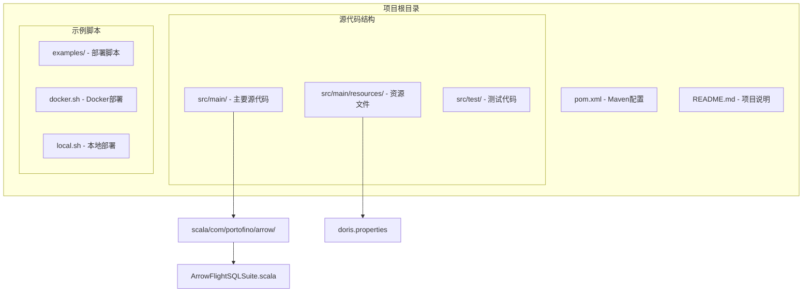
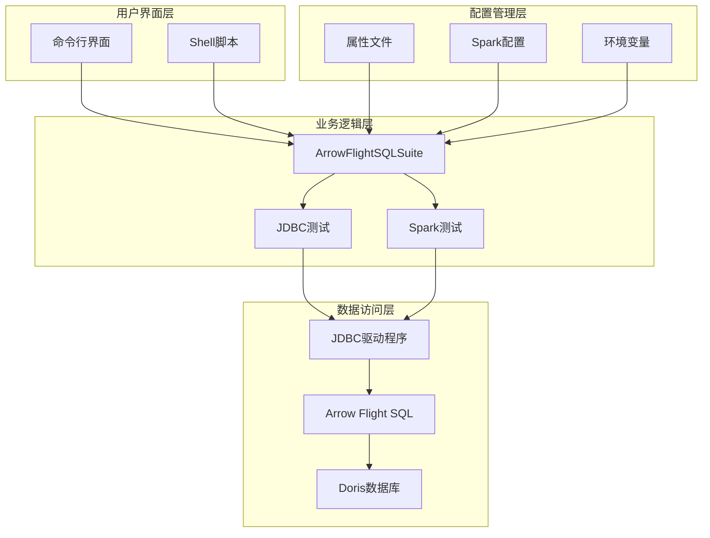
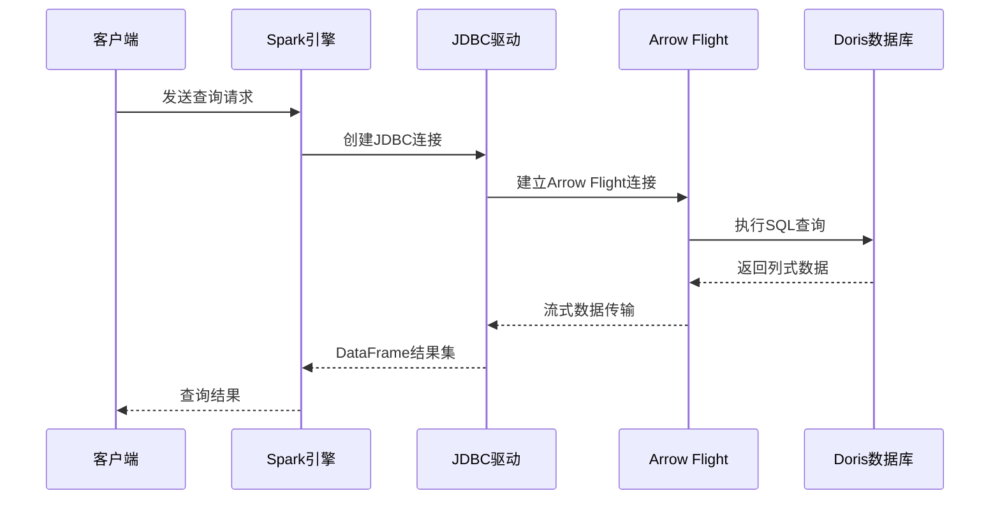
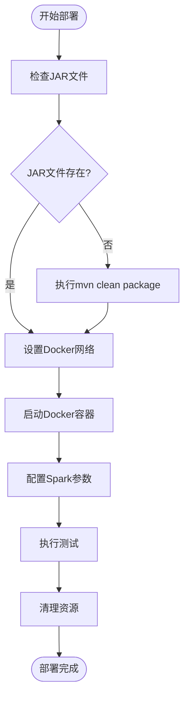
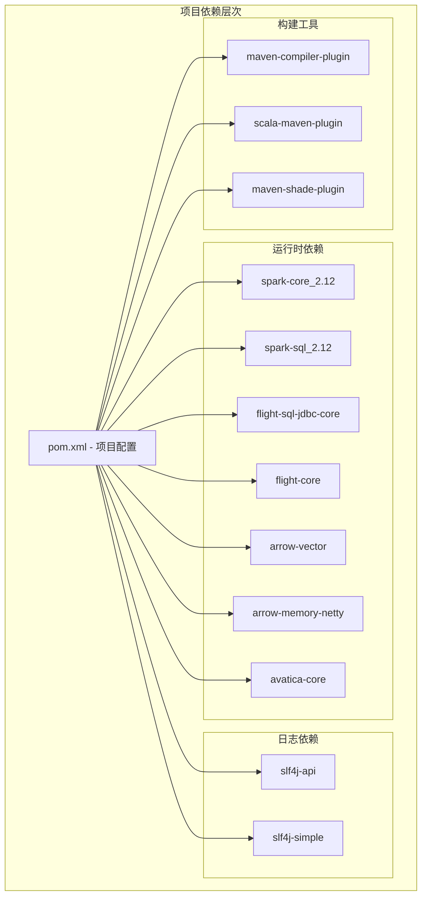

# 项目概述

<cite>
**本文档引用的文件**
- [README.md](file://README.md)
- [pom.xml](file://pom.xml)
- [ArrowFlightSQLSuite.scala](file://src/main/scala/com/portofino/arrow/ArrowFlightSQLSuite.scala)
- [doris.properties](file://src/main/resources/doris.properties)
- [docker.sh](file://examples/docker.sh)
- [local.sh](file://examples/local.sh)
</cite>

## 目录
1. [项目简介](#项目简介)
2. [项目结构](#项目结构)
3. [核心组件](#核心组件)
4. [架构概览](#架构概览)
5. [详细组件分析](#详细组件分析)
6. [依赖分析](#依赖分析)
7. [性能考虑](#性能考虑)
8. [故障排除指南](#故障排除指南)
9. [结论](#结论)

## 项目简介

Arrow Flight SQL测试项目是一个专门用于验证Apache Arrow Flight SQL协议与Apache Spark和Doris数据库集成的测试框架。该项目的核心目标是演示如何通过Arrow Flight SQL JDBC驱动程序实现高效的数据传输和查询执行，特别是在大数据生态系统中的应用。

### 项目目的

该项目旨在：
- 验证Arrow Flight SQL协议在实际生产环境中的可用性和性能
- 展示Apache Spark与Doris数据库通过Arrow Flight SQL的无缝集成
- 提供一个可复用的测试框架，用于验证不同配置下的数据访问模式
- 为开发者提供Arrow Flight SQL的实际使用示例和最佳实践

### 核心功能

项目包含以下核心功能模块：
- **直接JDBC连接测试**：验证Arrow Flight SQL JDBC驱动程序的直接连接能力
- **Spark JDBC读取测试**：演示通过Spark DataFrame API访问Doris数据
- **配置管理**：支持多种配置方式，包括Spark配置和属性文件
- **Docker容器化部署**：提供完整的容器化测试环境

## 项目结构

项目采用标准的Maven多模块结构，主要包含以下目录和文件：

**图表来源**
- [pom.xml](file://pom.xml#L1-L146)
- [ArrowFlightSQLSuite.scala](file://src/main/scala/com/portofino/arrow/ArrowFlightSQLSuite.scala#L1-L164)

**章节来源**
- [pom.xml](file://pom.xml#L1-L146)
- [README.md](file://README.md#L1-L3)

## 核心组件

### ArrowFlightSQLSuite主程序

项目的核心是`ArrowFlightSQLSuite`对象，它包含了完整的测试逻辑和数据访问流程。该组件负责：

#### 主要职责
- **Spark会话管理**：创建和配置SparkSession实例
- **配置参数处理**：从Spark配置中读取Arrow Flight SQL连接参数
- **JDBC连接测试**：验证直接JDBC连接的可行性
- **Spark DataFrame集成**：演示通过Spark访问Doris数据

#### 关键方法
- `main()`：应用程序入口点，协调整个测试流程
- `testJdbcConnection()`：执行直接JDBC连接测试
- `testSparkJdbcReader()`：验证Spark JDBC读取功能

**章节来源**
- [ArrowFlightSQLSuite.scala](file://src/main/scala/com/portofino/arrow/ArrowFlightSQLSuite.scala#L17-L61)

### 配置管理系统

项目提供了灵活的配置管理机制，支持多种配置来源：

#### 配置文件结构
- **doris.properties**：包含Doris数据库的基本连接信息
- **Spark配置**：通过命令行参数传递的动态配置
- **默认值**：为每个配置项提供合理的默认值

#### 配置参数详解
- `arrow.host`：Doris FE主机地址，默认"doris-fe"
- `arrow.port`：Arrow Flight SQL端口，默认"8070"
- `arrow.user`：认证用户名，默认"root"
- `arrow.password`：认证密码，默认空字符串
- `arrow.query`：测试查询语句，默认"SELECT * FROM test_db.user_visit LIMIT 100"

**章节来源**
- [ArrowFlightSQLSuite.scala](file://src/main/scala/com/portofino/arrow/ArrowFlightSQLSuite.scala#L32-L37)
- [doris.properties](file://src/main/resources/doris.properties#L1-L9)

## 架构概览

项目采用分层架构设计，清晰分离了数据访问层、业务逻辑层和展示层：

**图表来源**
- [ArrowFlightSQLSuite.scala](file://src/main/scala/com/portofino/arrow/ArrowFlightSQLSuite.scala#L19-L61)
- [pom.xml](file://pom.xml#L36-L83)

### 技术栈概览

项目采用现代化的大数据技术栈，确保了良好的兼容性和性能表现：

#### 核心技术组件

| 组件 | 版本 | 用途 | 依赖关系 |
|------|------|------|----------|
| Java | 11 | 运行时环境 | 基础平台 |
| Scala | 2.12.18 | 编程语言 | Spark核心 |
| Apache Spark | 3.5.8 | 大数据处理 | 核心引擎 |
| Apache Arrow | 17.0.0 | 列式内存格式 | 数据传输 |
| Apache Doris | - | 分布式数据库 | 数据存储 |

#### 关键依赖库

项目依赖多个Apache开源项目，形成了完整的大数据生态系统：

- **Apache Arrow Flight SQL JDBC Core**：提供Arrow Flight SQL协议的JDBC实现
- **Apache Arrow Flight Core**：Arrow Flight协议的核心实现
- **Apache Arrow Vector**：列式数据结构支持
- **Apache Calcite Avatica**：SQL标准兼容层

**章节来源**
- [pom.xml](file://pom.xml#L9-L17)
- [pom.xml](file://pom.xml#L19-L84)

## 详细组件分析

### Arrow Flight SQL协议实现

Arrow Flight SQL是Apache Arrow项目提供的高性能SQL查询协议，专为现代大数据场景设计：

#### 协议特性
- **列式数据传输**：相比传统行式传输，显著提升查询性能
- **零拷贝优化**：减少数据复制开销，提高吞吐量
- **流式处理**：支持大规模数据的流式传输和处理
- **类型安全**：强类型系统确保数据完整性

#### 实现架构

**图表来源**
- [ArrowFlightSQLSuite.scala](file://src/main/scala/com/portofino/arrow/ArrowFlightSQLSuite.scala#L66-L120)
- [ArrowFlightSQLSuite.scala](file://src/main/scala/com/portofino/arrow/ArrowFlightSQLSuite.scala#L125-L162)

### Spark集成机制

项目展示了如何将Arrow Flight SQL与Apache Spark无缝集成：

#### Spark DataFrame API
- **统一数据访问**：通过Spark DataFrame API访问Arrow Flight SQL数据源
- **分布式计算**：利用Spark的分布式计算能力处理大规模数据
- **Catalyst优化器**：自动优化查询计划和执行路径

#### 配置选项
- `doris.table.identifier`：指定要查询的表标识符
- `doris.fenodes`：Doris FE节点列表
- `doris.user/password`：认证凭据
- `doris.read.arrow-flight-sql.port`：Arrow Flight SQL端口

**章节来源**
- [ArrowFlightSQLSuite.scala](file://src/main/scala/com/portofino/arrow/ArrowFlightSQLSuite.scala#L142-L148)

### Docker部署架构

项目提供了完整的容器化部署方案，便于在不同环境中快速部署和测试：

#### 容器化优势
- **环境隔离**：确保测试环境的一致性
- **依赖管理**：自动处理所有依赖关系
- **可移植性**：简化部署和迁移过程

#### 部署流程

**图表来源**
- [docker.sh](file://examples/docker.sh#L29-L52)

**章节来源**
- [docker.sh](file://examples/docker.sh#L1-L58)
- [local.sh](file://examples/local.sh#L29-L54)

## 依赖分析

项目依赖关系复杂但结构清晰，体现了现代大数据项目的典型特征：

**图表来源**
- [pom.xml](file://pom.xml#L19-L84)

### 依赖版本策略

项目采用了精心设计的版本管理策略：

#### 版本兼容性
- **Java 11**：确保与现代JVM环境的兼容性
- **Scala 2.12.18**：与Spark 3.5.8的官方支持版本匹配
- **Apache Arrow 17.0.0**：提供最新的Arrow Flight SQL功能
- **Apache Spark 3.5.8**：稳定的企业级版本

#### 依赖冲突解决
- **二进制兼容性**：使用Scala 2.12二进制版本确保兼容性
- **版本锁定**：通过Maven属性统一管理版本号
- **依赖范围**：合理设置依赖作用域避免不必要的传递依赖

**章节来源**
- [pom.xml](file://pom.xml#L9-L17)

## 性能考虑

Arrow Flight SQL协议在大数据场景下具有显著的性能优势：

### 性能优化特性

#### 列式数据传输
- **零拷贝优化**：减少内存复制开销
- **向量化操作**：利用SIMD指令集加速数据处理
- **压缩传输**：在网络传输中减少带宽占用

#### 内存管理优化
- **内存池管理**：高效的内存分配和回收机制
- **垃圾回收优化**：减少GC停顿时间
- **内存映射文件**：支持超大文件的高效访问

### 性能基准测试

项目提供了多种测试场景来评估性能表现：

#### 基准测试指标
- **查询延迟**：从发送请求到接收结果的时间
- **吞吐量**：单位时间内处理的记录数
- **内存使用**：峰值内存占用和持续内存使用
- **CPU利用率**：处理器资源的使用效率

#### 优化建议
- **批量处理**：合理设置批大小以平衡内存和性能
- **并行度调优**：根据硬件配置调整并行度
- **缓存策略**：利用Arrow Flight SQL的查询缓存功能

## 故障排除指南

### 常见问题及解决方案

#### 连接问题
**问题**：无法建立Arrow Flight SQL连接
**可能原因**：
- 网络连接异常
- 认证失败
- 端口配置错误

**解决方案**：
1. 验证Doris FE服务状态
2. 检查防火墙和网络配置
3. 确认认证凭据正确性

#### 性能问题
**问题**：查询响应缓慢
**可能原因**：
- 数据量过大
- 网络带宽限制
- Spark配置不当

**解决方案**：
1. 优化查询语句
2. 调整Spark并行度
3. 检查网络带宽

#### 内存问题
**问题**：内存溢出或使用率过高
**可能原因**：
- DataFrame过大
- 缺少适当的过滤条件
- 内存配置不足

**解决方案**：
1. 添加WHERE条件限制数据量
2. 使用repartition()优化分区
3. 调整Spark内存配置

**章节来源**
- [ArrowFlightSQLSuite.scala](file://src/main/scala/com/portofino/arrow/ArrowFlightSQLSuite.scala#L53-L61)

### 调试技巧

#### 日志配置
- **SLF4J简单实现**：提供基本的日志输出功能
- **Spark日志级别**：根据需要调整日志详细程度
- **Arrow Flight SQL调试**：启用详细的协议调试信息

#### 监控指标
- **JVM内存使用**：监控堆内存和非堆内存使用情况
- **网络I/O**：跟踪数据传输速率和连接数
- **查询性能**：记录查询执行时间和资源消耗

## 结论

Arrow Flight SQL测试项目成功地展示了现代大数据技术栈的集成能力和性能优势。通过该项目，开发者可以：

### 技术价值
- **验证Arrow Flight SQL协议**：证明其在实际生产环境中的可行性和性能
- **展示Spark与Doris集成**：提供完整的数据访问解决方案
- **提供最佳实践示例**：为类似项目提供参考模板

### 应用场景
- **实时数据分析**：利用Arrow Flight SQL的高性能特性
- **大规模数据处理**：通过Spark实现分布式计算
- **云原生部署**：支持容器化和微服务架构

### 发展前景
随着Arrow Flight SQL协议的不断发展和完善，该项目将继续演进，为大数据生态系统贡献更多价值。建议关注以下发展方向：
- **协议标准化**：推动Arrow Flight SQL成为行业标准
- **生态扩展**：增加对更多数据库和数据源的支持
- **性能优化**：持续改进协议性能和资源利用率

通过这个项目，我们不仅验证了技术的可行性，更重要的是为大数据技术的发展和应用提供了宝贵的实践经验。